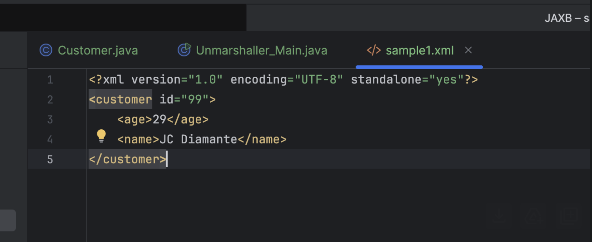
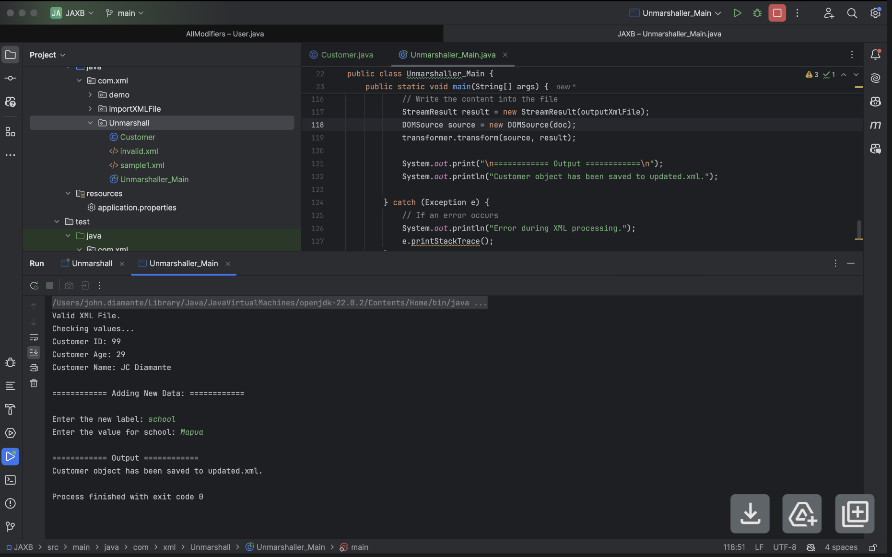
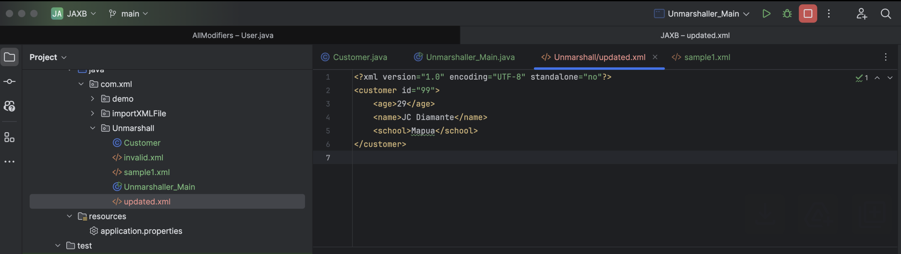

# JAXB-Activity

## Instructions

- Create a method to unmarshall, that is, to convert from XML file to Java object
- Verify that correct data has been obtained from unmarshalling using unit tests
- How to manually add lines to your xml output

Original XML File

Adding new Label and Value in the XML file

Updated XML file

